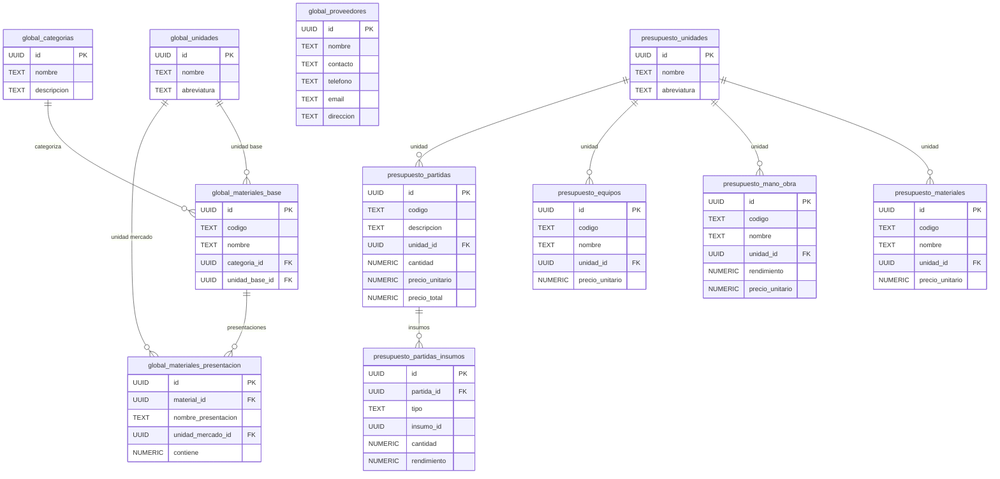

# ARKEHON — Database Overview (ER Diagram)

Este documento presenta la vista general del modelo de datos de Arkheon.  
Incluye la estructura de los tres módulos principales (global, presupuesto y obra) y sus relaciones clave.

---

# 📊 Diagrama ER (Mermaid)


erDiagram
    obra_general_obras ||--o{ obra_economia_inventario_material : "inventario"
    obra_general_obras ||--o{ obra_economia_proveedores : "proveedores"

    obra_economia_proveedores_catalogo ||--o{ obra_economia_proveedores : "asignacion"

    obra_economia_inventario_material ||--o{ obra_economia_presentacion_material : "presentaciones"
```
